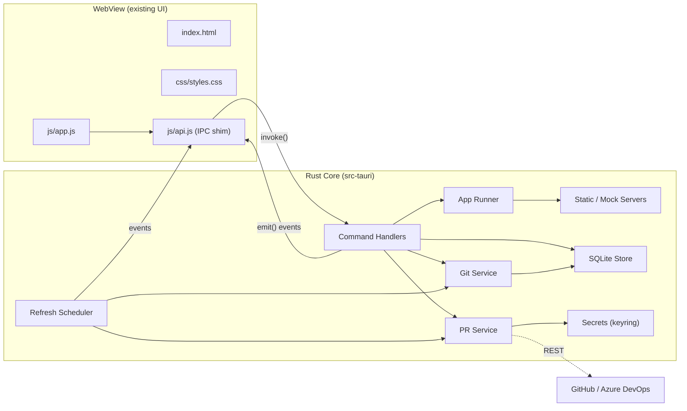
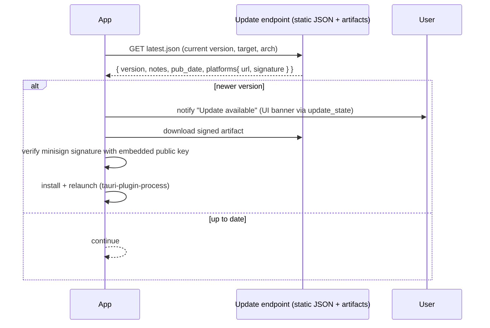

# DevCenter — Technical Design

> A cross‑platform desktop app to track local **Git repositories**, their **Pull Requests**, and manage **local applications** (run / stop / monitor) — built in **Rust**, packaged as an **installer**, with **auto‑update**, reusing the existing **vanilla HTML / CSS / JS** UI.

- **Status:** Draft v1
- **Date:** 2026‑06‑15
- **Target platforms:** Windows (primary), macOS, Linux

---

## 1. Goals & Non‑Goals

### Goals
1. Reuse the current vanilla **HTML/CSS/JS** front‑end as‑is (no SPA framework, no bundler required).
2. Implement all real logic in **Rust** behind a small, typed command surface.
3. Ship a signed, **installable** desktop binary per OS.
4. Support **silent/automatic updates** with signature verification.
5. Three feature domains, matching today's UI:
   - **Git Board** — discover, watch, fetch, and clone repos; show branch / ahead‑behind / dirty status.
   - **Pull Requests** — pull PRs from each watched repo's remote (GitHub / Azure DevOps), filter & search.
   - **App Center** — build, run, stop, and monitor local apps with live logs. Feature set is based on **[AppNest](https://github.com/BipulRaman/AppNest)** (the user's own MIT‑licensed Rust app manager): one‑click build & run, multi‑app hosting on different ports, framework presets, static‑folder serving, Swagger/OpenAPI **API mock**, and streamed logs.

### Non‑Goals (v1)
- Full Git client (no staging/commit/merge UI — only fetch/clone/checkout helpers).
- Code review *inside* the app (we deep‑link to the provider for review).
- Multi‑user / cloud sync. All state is local to the machine.

---

## 2. Technology Choice

### Framework: **Tauri 2.x**

Tauri is the natural fit because it satisfies every hard constraint:

| Requirement | How Tauri delivers |
|---|---|
| Rust backend | Core process is Rust; business logic lives in `src-tauri`. |
| Reuse vanilla HTML/CSS/JS | Front‑end is just static assets served to the system WebView — no framework needed. |
| Installable | First‑class bundlers: **NSIS** + **MSI** (Windows), **.dmg/.app** (macOS), **.deb/.rpm/.AppImage** (Linux). |
| Auto‑update | Official **`tauri-plugin-updater`** with minisign signature verification. |
| Small footprint | Uses the OS WebView (WebView2 / WKWebView / WebKitGTK) — no bundled Chromium. |

**Alternatives considered & rejected:** Electron (not Rust), `egui`/`Slint` (don't reuse HTML/CSS/JS), raw `wry`/`webview` (no installer/updater story out of the box).

**Prior art / reuse:** **[AppNest](https://github.com/BipulRaman/AppNest)** (MIT, by the same author) already implements the *entire* App Center feature set in **Rust + Axum + Tokio + vanilla JS** as a portable binary. Its process‑lifecycle/logging (`manager.rs`) and static‑serving + Swagger‑mock (`server.rs`) port almost directly into §5.5; the only adaptation is that AppNest streams logs over **SSE** to a browser dashboard, whereas DevCenter streams them as **Tauri events** to the WebView. This de‑risks Phase 2 substantially.

### Key crates

| Concern | Crate(s) |
|---|---|
| App shell / IPC / packaging | `tauri`, `tauri-build` |
| Updater | `tauri-plugin-updater`, `tauri-plugin-process` (relaunch) |
| OS integration | `tauri-plugin-dialog`, `tauri-plugin-opener`, `tauri-plugin-shell` |
| Async runtime | `tokio` |
| Git (in‑process) | `git2` (libgit2) — status, branch, ahead/behind, fetch, clone, checkout |
| HTTP / REST clients | `reqwest` (rustls), `serde`, `serde_json` |
| GitHub API | `octocrab` (optional convenience) or raw `reqwest` |
| Secrets (tokens) | `keyring` (OS keychain / Credential Manager) |
| Local store | `rusqlite` (bundled SQLite) + `tauri-plugin-store` for light prefs |
| Static file server | `axum` + `tower-http` (`ServeDir`, SPA fallback) — from AppNest |
| API mock | `openapiv3` (parse spec) + `axum` (serve) + embedded **Swagger UI** assets (offline) — from AppNest |
| App presets | `presets.json` shipped as a front‑end asset (.NET, Node, React, Next, Angular, Vue, Express, API Mock) |
| Native file/folder pickers | `tauri-plugin-dialog` (replaces AppNest's `rfd`) |
| System tray | `tauri::tray` (Start All / Stop All / Quit) |
| Process metrics | `sysinfo` |
| Logging | `tracing`, `tracing-subscriber` |

---

## 3. High‑Level Architecture



**Process model:** one Rust core process owns all state and spawns:
- short‑lived **async tasks** for Git/PR refresh,
- long‑lived **child processes** for each running app,
- in‑process **axum servers** for static‑folder and API‑mock app types.

State changes are pushed to the UI via Tauri **events** so the existing render functions just re‑draw.

---

## 4. Front‑End Integration (reusing the current UI)

The current `js/app.js` holds **mock arrays** (`repos`, `apps`, `pulls`) and renders from them. We keep all rendering, navigation, theme, and filtering code **unchanged**. We only replace the data source.

### 4.1 Add a thin IPC layer: `js/api.js`

A small **classic script** (no bundler, no ES modules) wraps Tauri's global API and exposes a single `window.DevCenter` object. Inside the desktop app, calls route to the Rust core; in a plain browser (no backend) the data methods resolve to `null` so `app.js` falls back to its in‑page seed data — keeping the UI runnable for pure design work.

```js
// js/api.js  (loaded before app.js; sets window.DevCenter)
(function () {
  const T = window.__TAURI__;                 // present only inside the desktop app
  const hasBackend = !!(T && T.core);
  const invoke = (cmd, args) => T.core.invoke(cmd, args);
  const listen = (evt, cb) => T.event.listen(evt, (e) => cb(e.payload));

  window.DevCenter = {
    hasBackend,

    // OS helpers (Phase 0 — implemented)
    appVersion:   ()     => hasBackend ? invoke("app_version")             : Promise.resolve("browser"),
    openPath:     (path) => hasBackend ? invoke("open_path", { path })     : Promise.resolve(),
    openUrl:      (url)  => hasBackend ? invoke("open_url",  { url })      : Promise.resolve(),
    openTerminal: (path) => hasBackend ? invoke("open_terminal", { path }) : Promise.resolve(),

    // Data APIs (Phase 1–3 — null in browser ⇒ app.js uses its in-page seed)
    listRepos:        ()        => hasBackend ? invoke("list_repos")                      : Promise.resolve(null),
    listPullRequests: (repoIds) => hasBackend ? invoke("list_pull_requests", { repoIds }) : Promise.resolve(null),
    listApps:         ()        => hasBackend ? invoke("list_apps")                       : Promise.resolve(null),
    // …fetchRepo, cloneRepo, setWatched, startApp, stopApp, createApp, setToken…

    // Live updates (backend → UI; no-ops in a plain browser)
    onReposUpdated: (cb) => hasBackend ? listen("repos_updated", cb)         : Promise.resolve(() => {}),
    onPullsUpdated: (cb) => hasBackend ? listen("pull_requests_updated", cb) : Promise.resolve(() => {}),
    onAppStatus:    (cb) => hasBackend ? listen("app_status_changed", cb)    : Promise.resolve(() => {}),
    onAppLog:       (cb) => hasBackend ? listen("app_log", cb)               : Promise.resolve(() => {}),
  };
})();
```

> The full surface lives in [`app/js/api.js`](app/js/api.js).

### 4.2 Minimal changes to `app.js`
- Replace the three top `const repos/apps/pulls = [...]` literals with `let` variables hydrated from `DevCenter.list*()` on startup.
- After each successful command, either optimistically update or wait for the corresponding `*_updated` event, then call the existing `render*()` functions.
- Wire live log streaming (`onAppLog`) into a logs panel/drawer (new lightweight view; reuses existing chip/row styles).

> The DOM structure, CSS, icons, navigation, theme toggle, search and filters all stay exactly as they are today.

### 4.3 Loading assets in Tauri
- Enable `app.withGlobalTauri = true` so `window.__TAURI__` is available without a bundler.
- Point `build.frontendDist` at the folder that holds `index.html` — here `"../ui"` (the `app/ui/` folder, relative to `app/src-tauri/`). It is kept separate from `src-tauri/` so the asset embedder never recurses into the Rust `target/` output. No dev server or compile step is required for the front‑end.

---

## 5. Backend Design (Rust)

### 5.1 Module layout

```
app/src-tauri/
  Cargo.toml
  tauri.conf.json
  build.rs
  capabilities/
    default.json              # permission allowlist
  icons/
  src/
    main.rs                   # builder, plugins, state, handler registration
    state.rs                  # AppState (Arc<...>) shared across commands
    error.rs                  # AppError -> serde-serializable
    models.rs                 # Repo, PullRequest, AppDef, AppStatus, ...
    store/
      mod.rs                  # SQLite open/migrate
      repos.rs  apps.rs  settings.rs
    secrets.rs                # keyring wrappers (tokens)
    git/
      mod.rs  service.rs      # status, branch, ahead/behind, fetch, clone, checkout
    pr/
      mod.rs  github.rs  azure.rs  provider.rs   # remote -> provider detection
    apps/
      mod.rs  runner.rs       # spawn/stop/monitor child processes + logs
      static_server.rs        # axum ServeDir for "Static Folder" apps
      mock_server.rs          # axum + openapiv3 for "API Mock" apps
    scheduler.rs              # periodic git + PR refresh; emits events
    commands/
      git.rs  pr.rs  apps.rs  os.rs  config.rs
```

### 5.2 Shared state

```rust
// state.rs
pub struct AppState {
    pub db: Arc<Mutex<rusqlite::Connection>>,
    pub git: Arc<GitService>,
    pub prs: Arc<PrService>,
    pub runner: Arc<AppRunner>,      // owns child processes + in-proc servers
    pub settings: Arc<RwLock<Settings>>,
}
```

Registered once in `main.rs` via `.manage(app_state)` and accessed in commands through `tauri::State<'_, AppState>`.

### 5.3 Git Service (`git2`)
- **Discover:** scan configured root folders for `.git` directories (bounded depth) → register repos.
- **Status:** open repo, read `HEAD` branch, compute `ahead/behind` vs upstream (`graph_ahead_behind`), and dirty flag (`statuses()` non‑empty).
- **Fetch:** by default **shell out to system `git`** so fetch/clone transparently reuse the developer's existing credentials (Git Credential Manager, OS store, ssh‑agent) — see §5.4.1. The in‑process `git2` path uses a credential callback as a fallback.
- **Clone:** `git2::build::RepoBuilder` (or system `git clone`) into a chosen directory.
- **Checkout:** create/switch local branch for a PR head.

> Read‑only operations (status / ahead‑behind) are fast and run on a thread pool; network operations (fetch/clone) are async and report progress via events.

### 5.4 PR Service
- **Provider detection** from the remote URL: `github.com` → GitHub; `dev.azure.com` / `*.visualstudio.com` → Azure DevOps. (GitLab/Bitbucket are pluggable later.)
- **Auth:** see §5.4.1 — a single keychain‑stored PAT per host serves both git transport and the REST API.
- **Fetch PRs** for each watched repo, normalize to the common `PullRequest` model (id, title, author, branch→base, status, review state, comments, additions/deletions, updated).
- **Caching & rate‑limit safety:** persist last results + `ETag`/`updated` watermark in SQLite; respect provider rate limits with backoff.

### 5.4.1 Authentication (Git transport + provider APIs)

There are **two distinct auth surfaces**, and the guiding principle is to **reuse the developer's existing credentials**, storing our own token only when none exists.

| Surface | Used for | Mechanism |
|---|---|---|
| **Git transport** | clone / fetch / checkout (HTTPS or SSH) | Delegate to the user's existing Git setup |
| **Provider REST** | Pull Requests (GitHub / Azure DevOps) | Token (PAT / OAuth) sent on each API call |

**A. Git transport** — by default **shell out to the system `git`** for fetch/clone, so it transparently uses **Git Credential Manager** (ships with Git for Windows), the OS credential store, or **ssh‑agent** — exactly like the terminal. This needs no new prompts and automatically covers **Entra ID / SSO for Azure DevOps** and SSH keys. When the in‑process `git2` path is used instead, a `RemoteCallbacks::credentials` callback resolves in order: SSH agent for `git@…` URLs → `git credential fill` (GCM) for HTTPS → our stored PAT as a last resort.

**B. Provider REST (PRs)**

| Provider | Token | How it's sent | Notes |
|---|---|---|---|
| **GitHub** | Fine‑grained or classic **PAT** (repo / PR‑read scope) | `Authorization: Bearer <token>` | Optional later: OAuth **device flow** / GitHub App for tokenless onboarding. |
| **Azure DevOps** | **PAT** (scopes: *Code (read)*, *Pull Request (read)*) | HTTP **Basic** with empty username + PAT as password: `Authorization: Basic base64(":"+PAT)` | Or an **Entra ID bearer token** for enterprise SSO. Requires org URL `dev.azure.com/{org}` + project. |

**One token, both surfaces:** a GitHub/ADO PAT authenticates **both** git HTTPS transport **and** the REST API, so a single stored token per host covers fetch *and* PRs.

**Storage & flow**
- Tokens live in the **OS keychain** via `keyring` (Windows Credential Manager / macOS Keychain / Linux Secret Service), keyed by host/org (e.g. `github.com`, `dev.azure.com/myorg`).
- `set_token(host, token)` stores; `test_connection(host)` validates; `auth_status()` reports which hosts are configured. Tokens are **never** written to SQLite or logs and are **redacted** in traces.
- The Settings page lets the user paste a PAT per host and "Test connection". On a `401/403`, the backend emits `auth_required` so the UI can prompt for (re)entry.

### 5.5 App Runner

> **Basis:** ported from **AppNest** `manager.rs` + `server.rs`. AppNest's SSE log channel becomes Tauri `app_log` events; its `rfd` dialogs become `tauri-plugin-dialog`; its `apps.json` store becomes the SQLite `apps` table; its embedded Swagger UI and `ServeDir` carry over unchanged.

**Serve modes** (the app's `serveMode`):

| Mode | Behaviour |
|---|---|
| **Command** | Run the build lines in order, then spawn the **last line** as the long‑running process via `tokio::process::Command` in the working dir. **No shell** — command + args are passed as an array to prevent injection. `stdout`/`stderr` are captured line‑by‑line. |
| **Static Folder** | Serve a build output dir (`./dist`, `./build`, …) via in‑process **axum** `ServeDir` with **SPA fallback** on the chosen port — no `npx serve` needed. |
| **Script File** | Execute a single selected script file (its interpreter inferred from extension/preset) as the run process. |
| **API Mock** | Parse a Swagger 2.0 / OpenAPI 3.x JSON spec and run a live mock server (details below). |

**Framework presets** — a front‑end `presets.json` (.NET, Node.js, React, Next.js, Angular, Vue, Express, API Mock) pre‑fills the build/run commands, default port, and serve mode when a type is picked. Users can customise per app. Each app config carries: `name`, `workingDir`, `type`, `serveMode`, `port`, `commands[]` (build lines + final run line), `env[]` (KEY=VALUE), and `autostart`.

**Port injection** — the chosen port is exported to the child as `PORT` (and `ASPNETCORE_URLS=http://localhost:<port>` for .NET) so most frameworks bind correctly with zero extra config.

**Lifecycle** — `start` runs build steps (streaming their output) then launches the run process, tracking PID + start time; `stop` terminates gracefully then kills; `restart` chains the two. Crashes are auto‑detected → state `error` + `app_status_changed`. **Pending‑state** is emitted around every transition so the UI can lock Start/Restart buttons and prevent double‑fires.

**API Mock** (from AppNest) — given a Swagger/OpenAPI JSON:
- serves **Swagger UI** at `/` and the raw spec at `/swagger.json` (Swagger UI assets are embedded for **offline** use);
- registers **one route per `paths × method`**, returning JSON synthesised from the operation's `example` → `examples` → `schema` (resolves `$ref`, `allOf`, `oneOf`, `enum`, formats `date-time`/`uuid`/`email`, and OpenAPI 3.1 type arrays);
- maps path params (`{id}` → `:id`) and honours Swagger 2.0 `basePath` / OpenAPI 3 `servers[0].url`;
- binds to **`127.0.0.1` only**, no auth (local dev fixture).

**Logs** — each line is streamed over a `tokio::mpsc` channel and emitted as an `app_log` event `{ id, line, stream, level, ts }`. The UI renders **ANSI colors**, makes URLs clickable, timestamps lines, and highlights `error`/`warn`. A per‑app **ring buffer** (last N lines) feeds the **inline preview** (tail shown in each row) and late subscribers; full logs are also written to per‑app files under the app‑data dir and can be **exported/copied**. The logs view supports **in‑log search** (filter + highlight) and **follow mode** (pause/resume auto‑scroll).

**UI affordances** (reuse existing styles where possible): live **uptime / PID / port chip** (left‑click opens the URL, right‑click copies it), **auto‑start** flag, **drag‑to‑reorder**, a **command palette** (`Ctrl/Cmd+K`) fuzzy launcher for apps + actions, and **Start All / Stop All** from both the toolbar and a **system tray** menu.

**Metrics** — `sysinfo` samples CPU/memory/uptime for running apps on an interval → `app_metrics`.

**Cleanup** — on app exit, all child processes and in‑process servers are terminated (kill‑on‑drop) so nothing is orphaned.

### 5.6 Scheduler
A background `tokio` task loop:
- every *N* minutes (configurable): refresh Git status for all repos, then refresh PRs for watched repos;
- coalesces results and emits `repos_updated` / `pull_requests_updated`;
- pauses network work when offline; backs off on errors.

---

## 6. Data Model

Rust structs are `#[derive(Serialize, Deserialize)]` and serialize to the **same shapes the current UI already consumes** (camelCase via `#[serde(rename_all = "camelCase")]`).

```rust
// models.rs
#[derive(Serialize, Deserialize, Clone)]
#[serde(rename_all = "camelCase")]
pub struct Repo {
    pub id: String,
    pub name: String,
    pub path: String,
    pub branch: String,
    pub remote: String,
    pub provider: Provider,        // GitHub | AzureDevOps | Other
    pub status: RepoStatus,        // Clean | Dirty
    pub ahead: u32,
    pub behind: u32,
    pub last_fetch: Option<String>,
    pub watched: bool,
}

#[derive(Serialize, Deserialize, Clone)]
#[serde(rename_all = "camelCase")]
pub struct PullRequest {
    pub id: u64,
    pub title: String,
    pub repo: String,
    pub author: String,
    pub branch: String,
    pub base: String,
    pub status: PrStatus,          // Open | Draft | Merged
    pub reviews: ReviewState,      // Approved | Changes | Pending
    pub comments: u32,
    pub additions: u32,
    pub deletions: u32,
    pub updated: String,
    pub url: String,               // deep-link to provider
}

#[derive(Serialize, Deserialize, Clone)]
#[serde(rename_all = "camelCase")]
pub struct AppDef {
    pub id: String,
    pub name: String,
    pub app_type: String,          // preset key: ".net" | "node" | "react" | "next" | "angular" | "vue" | "express" | "api-mock"
    pub serve_mode: ServeMode,     // Command | StaticFolder | ScriptFile | ApiMock
    pub working_dir: String,
    pub commands: Vec<String>,     // Command mode: build lines in order; last line = run command
    pub script: Option<String>,    // ScriptFile mode
    pub static_dir: Option<String>,// StaticFolder mode (e.g. ./dist) — served with SPA fallback
    pub spec_path: Option<String>, // ApiMock mode: Swagger/OpenAPI JSON path
    pub env: Vec<(String, String)>,// KEY=VALUE; PORT auto-injected (ASPNETCORE_URLS for .NET)
    pub port: Option<u16>,
    pub autostart: bool,
    pub order: u32,                // drag-to-reorder position
}

#[derive(Serialize, Deserialize, Clone)]
#[serde(rename_all = "camelCase")]
pub struct AppStatus {
    pub id: String,
    pub state: RunState,           // Running | Stopped | Error
    pub pid: Option<u32>,
    pub uptime: String,
    pub cpu: f32,
    pub mem_mb: u32,
}
```

### SQLite schema (sketch)

```sql
CREATE TABLE repos    (id TEXT PRIMARY KEY, name TEXT, path TEXT UNIQUE, remote TEXT,
                       provider TEXT, watched INTEGER, last_fetch TEXT);
CREATE TABLE apps     (id TEXT PRIMARY KEY, name TEXT, kind TEXT, working_dir TEXT,
                       command TEXT, args TEXT, env TEXT, port INTEGER, autostart INTEGER);
CREATE TABLE pr_cache (repo TEXT, id INTEGER, payload TEXT, updated TEXT,
                       PRIMARY KEY (repo, id));
CREATE TABLE settings (key TEXT PRIMARY KEY, value TEXT);
-- Secrets (PATs) live in the OS keychain, NOT here.
```

---

## 7. IPC Surface

### Commands (UI → Rust, via `invoke`)

| Command | Args | Returns | Purpose |
|---|---|---|---|
| `list_repos` | — | `Vec<Repo>` | Git Board list + stats |
| `scan_repos` | `roots: string[]` | `Vec<Repo>` | Discover repos under folders |
| `git_fetch` | `id` | `Repo` | Fetch one repo |
| `git_clone` | `url, dir` | `Repo` | Clone + register |
| `git_checkout` | `id, branch` | `()` | Checkout PR branch |
| `set_repo_watched` | `id, watched` | `()` | Toggle PR watching |
| `list_pull_requests` | `repoIds?` | `Vec<PullRequest>` | PR list (filtered) |
| `refresh_pull_requests` | — | `()` | Force PR refresh |
| `set_token` | `host, token` | `()` | Store PAT in OS keychain |
| `test_connection` | `host` | `bool` | Validate a stored token against the provider |
| `auth_status` | — | `Vec<{host, configured}>` | Which hosts have a token |
| `list_apps` | — | `Vec<AppDef+Status>` | App Center list |
| `list_presets` | — | `Vec<Preset>` | Framework presets (from `presets.json`) |
| `create_app` / `update_app` | `app` | `AppDef` | Add / edit a local app |
| `delete_app` | `id` | `()` | Remove an app |
| `reorder_apps` | `ids: string[]` | `()` | Persist drag‑to‑reorder |
| `start_app` / `stop_app` / `restart_app` | `id` | `AppStatus` | Lifecycle |
| `start_all_apps` / `stop_all_apps` | — | `()` | Bulk + tray actions |
| `app_logs` | `id, tail?` | `string[]` | Fetch buffered logs |
| `export_logs` | `id` | `String` | Write/return per‑app log file |
| `open_path` / `open_terminal` | `path` | `()` | OS integration |
| `open_url` | `url` | `()` | Deep-link to provider |
| `check_for_update` | — | `UpdateInfo` | Manual update check |

### Events (Rust → UI, via `emit`)

| Event | Payload | When |
|---|---|---|
| `repos_updated` | `Vec<Repo>` | After scan/fetch/scheduler |
| `repo_progress` | `{ id, phase, pct }` | Long fetch/clone |
| `pull_requests_updated` | `Vec<PullRequest>` | After PR refresh |
| `auth_required` | `{ host, provider }` | A provider call returned 401/403 |
| `app_status_changed` | `AppStatus` | Start/stop/restart/crash + pending transitions |
| `app_log` | `{ id, line, stream, level, ts }` | Each log line (ANSI/level for UI highlight) |
| `app_metrics` | `AppStatus` | Periodic sampling |
| `update_state` | `{ phase, pct, version }` | Updater progress |

### Example command

```rust
// commands/apps.rs
#[tauri::command]
pub async fn start_app(
    id: String,
    state: tauri::State<'_, AppState>,
    app: tauri::AppHandle,
) -> Result<AppStatus, AppError> {
    let status = state.runner.start(&id, &app).await?;   // spawns process / server, streams logs
    app.emit("app_status_changed", &status).ok();
    Ok(status)
}
```

---

## 8. Packaging & Installers

Configured under `bundle` in `tauri.conf.json`.

| OS | Artifacts | Notes |
|---|---|---|
| **Windows** | **NSIS** `.exe` (per‑user, updater‑friendly) + optional **MSI** (WiX, for enterprise/GPO) | Requires **WebView2** (Tauri can bootstrap/offline‑embed it). |
| **macOS** | `.dmg` + `.app` | **Codesign + notarize** (Developer ID) to avoid Gatekeeper blocks. |
| **Linux** | `.AppImage`, `.deb`, `.rpm` | AppImage is the simplest self‑contained updater target. |

### Code signing (required for a trustworthy installer)
- **Windows:** Authenticode certificate (ideally **EV/OV**) to satisfy SmartScreen; sign installer **and** the updater artifacts.
- **macOS:** Developer ID Application + Installer certs; notarize via `notarytool`.
- Secrets (certs, keychain passwords, signing keys) are injected from CI secrets — never committed.

---

## 9. Auto‑Update

Uses **`tauri-plugin-updater`** (pull‑based, signature‑verified).

### Flow


### Mechanics
- Generate a **minisign keypair** (`tauri signer generate`). The **public key** is embedded in `tauri.conf.json`; the **private key** signs release artifacts in CI and is stored only as a CI secret.
- Host a static **`latest.json`** manifest + artifacts on **GitHub Releases** (or any static/CDN host).
- Updater checks **on launch** and on a periodic timer; progress is surfaced to the UI through the `update_state` event so we can show a banner using existing chip/button styles.
- Updates apply **only** when the downloaded artifact's signature verifies against the embedded public key (prevents tampered/MITM updates).

```jsonc
// tauri.conf.json (excerpt)
{
  "plugins": {
    "updater": {
      "active": true,
      "pubkey": "<MINISIGN_PUBLIC_KEY>",
      "endpoints": [
        "https://downloads.example.com/devcenter/latest.json"
      ],
      "windows": { "installMode": "passive" }
    }
  }
}
```

---

## 10. Security

| Area | Control |
|---|---|
| **Capability allowlist** | Tauri v2 **capabilities/permissions** — expose only the commands and plugin scopes the UI needs; deny FS/shell broadly. |
| **CSP** | Strict `Content-Security-Policy` in `tauri.conf.json`; `default-src 'self'`. (Note: Google Fonts is remote — either allow that origin explicitly or self‑host Inter to keep CSP tight and enable offline use.) |
| **Secrets** | PATs in OS keychain via `keyring`; never logged, never in SQLite, redacted in logs. |
| **Command injection** | App Runner spawns with **arg arrays, no shell**; validate working dirs and ports. |
| **Path traversal** | Static server uses `ServeDir` rooted at the app folder; canonicalize and reject escapes. |
| **Update integrity** | Minisign signature verification + HTTPS endpoints. |
| **Network** | `reqwest` with `rustls`; TLS enforced for all provider/API calls. |
| **Least privilege** | App requests no admin rights; per‑user install. |

---

## 11. Project Structure (final)

```
~DevCenter/
├─ Design.md                     # this document
├─ .github/workflows/release.yml # CI: build, sign, publish, update manifest (Phase 5)
└─ app/                          # the complete desktop application
   ├─ ui/                        # web assets (frontendDist = "../ui")
   │  ├─ index.html              # existing UI (now loads js/api.js before js/app.js)
   │  ├─ css/styles.css          # existing
   │  └─ js/
   │     ├─ app.js               # existing render logic (data source swapped in Phase 1+)
   │     └─ api.js               # IPC shim → window.DevCenter
   └─ src-tauri/                 # Rust core
      ├─ Cargo.toml
      ├─ tauri.conf.json         # withGlobalTauri, frontendDist "../ui", CSP
      ├─ build.rs
      ├─ capabilities/default.json
      ├─ icons/                  # generated via `cargo tauri icon`
      └─ src/
         ├─ main.rs              # entry → devcenter_lib::run()
         └─ lib.rs               # builder + commands; §5.1 modules added per phase
```

---

## 12. Build & Dev Workflow

```powershell
# One-time
cargo install tauri-cli --version "^2" --locked

# Generate the icon set from one source image (required before the first build)
cd app/src-tauri
cargo tauri icon ../../scripts/app-logo.png   # writes icons/* (.png, .ico, .icns)

# Develop — opens the desktop window and serves the static UI from app/ui/
cd app
cargo tauri dev

# Produce installers for the current OS
cargo tauri build

# Generate updater signing keys (Phase 5; keep the private key secret)
cargo tauri signer generate -w devcenter.key
```

- **Front‑end** needs no build step (vanilla assets). `cargo tauri dev` serves them directly.
- With no backend (`DevCenter.hasBackend === false`), data APIs resolve to `null`, so the UI still opens in a normal browser (using `app.js`'s in‑page seed) for pure CSS/markup work.

### CI (GitHub Actions, matrix per OS)
1. Build with `tauri-action`.
2. Code‑sign (Windows Authenticode / macOS notarize).
3. Sign updater artifacts with minisign.
4. Publish artifacts + **`latest.json`** to GitHub Releases / CDN.

---

## 13. Delivery Phases

| Phase | Scope | Outcome |
|---|---|---|
| **0 — Shell** | Tauri scaffold under `app/`; loads the existing UI; `withGlobalTauri`; `api.js` shim + Phase 0 OS commands (`app_version`, `open_path`, `open_url`, `open_terminal`). | **✅ Done** — window shows today's UI; first IPC commands live. |
| **1 — Git Board** | `git2` status/scan/fetch/clone; SQLite store; scheduler; `repos_updated`. | Real repos, live status, watch toggle persisted. |
| **2 — App Center** | Port AppNest's runner: serve modes (Command/Static/Script/API‑Mock), framework presets, build pipeline + port injection, embedded Swagger‑UI mock, log streaming (ANSI/search/follow/inline preview), tray + command palette, drag‑reorder, persistence. | Build/run/monitor local apps — AppNest parity inside DevCenter. |
| **3 — Pull Requests** | Provider detection, keychain tokens, GitHub + Azure DevOps clients, PR cache. | Real PRs for watched repos with filters. |
| **4 — Package** | Icons, bundler config, Windows/macOS/Linux installers, code signing. | Installable signed builds. |
| **5 — Auto‑update** | Updater plugin, minisign keys, `latest.json`, CI release pipeline, in‑app banner. | One‑click / silent updates. |
| **6 — Polish** | Offline handling, error toasts, settings page (scan roots, intervals, tokens), self‑hosted fonts. | Production‑ready. |

---

## 14. Open Questions / Decisions to Confirm

1. **Update hosting:** GitHub Releases vs. self‑hosted CDN for `latest.json` + artifacts?
2. **Providers in v1:** GitHub + Azure DevOps only, or also GitLab/Bitbucket?
3. **Windows installer:** NSIS (per‑user, best for auto‑update) as default, MSI as optional enterprise track — confirm.
4. **Fonts/offline:** self‑host **Inter** to tighten CSP and work offline (recommended) vs. keep Google Fonts CDN?
5. **App persistence depth:** keep run history/log archives in SQLite, or live logs only?
6. **Code‑signing certs:** availability of Windows Authenticode (EV?) and Apple Developer ID for CI?
7. **AppNest reuse:** port AppNest's `manager.rs`/`server.rs` into DevCenter's `apps/` module directly, or keep AppNest as a separate binary that DevCenter launches/embeds? (Recommended: port the modules so App Center is native to DevCenter.)
```
